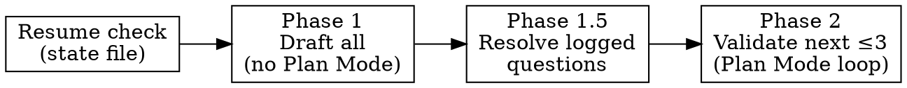

# Batch Plan Validate

Orchestrates `superpowers:writing-plans` / `superpowers:brainstorming` (or another doc-producing skill) across a **queue of tasks**, so the user reviews N plans/specs one at a time through the standard `EnterPlanMode → ExitPlanMode → Plannotator` pattern, without being interrupted by blocking questions until drafting is done.

Drafting and validation are decoupled: **Phase 1 always drafts the entire queue** (a full roadmap can be dozens of tasks), while **Phase 2 validates at most 3 tasks per invocation**. Progress across both phases is persisted in a **queue state file**, so the user can validate 3 tasks, go implement them, and re-invoke this reference later — it resumes exactly where it left off instead of re-drafting or re-validating anything.

**REQUIRED BACKGROUND:** the underlying skills for each task are `writing-prd`, `superpowers:writing-plans`, and `superpowers:brainstorming` — this reference only adds the queue/phase orchestration around them. Storage/naming (the per-task `docs/<feature-slug>/steps/<step-slug>/` folder) is governed by `roadmap/SKILL.md` — read it before drafting anything. Read the project overrides for the underlying skills (`.claude/rules/skills/writing-plans.md`, `.claude/rules/skills/brainstorming.md`) if the current project has them.

Use this reference for a roadmap's remaining steps, or an explicit list of independent tasks. For a generic "continue the roadmap" request that doesn't specify documentation vs. implementation, use `references/resuming-work.md` first — it decides whether this reference or `references/executing-checkpoints.md` applies.

## When to Use

- The user wants several related planning/spec documents produced and reviewed in sequence (a roadmap's remaining steps, a list of independent tickets, etc.).
- NOT for a single plan/spec — use `writing-plans`/`brainstorming` directly.
- NOT when the tasks aren't independent enough to draft without resolving cross-task decisions first — resolve that dependency with the user before starting the queue.

## Input

Ask the user (if not already given) which of these the task queue comes from:

1. **Roadmap file** — parse top-level unchecked `- [ ]` checklist items as queue entries; task id = the item's label/number (e.g. `B4`, `C`); step-slug = the slug for that task's `docs/<feature-slug>/steps/<step-slug>/` folder (`roadmap/SKILL.md`). If the step folder already has a `-design.md` or `-prd.md`, pass it as context to the drafting skill instead of redrafting it.
2. **Explicit list** — the user names the tasks directly in the request.

Every task drafts a step-level PRD (`writing-prd`) first, unless one already exists in its step folder. Then confirm which of these three per-task drafting modes to use — the user may override per task:

- **`writing-plans`** (plan directly) — default when an approved design already exists or the step needs no architectural decision.
- **`brainstorming` → `writing-plans`** (design, then auto-chain into a plan once approved) — default for any task without settled architecture, when the plan is wanted now.
- **`brainstorming`, design-only** (design, no follow-up plan pass) — use when implementation plans will be written later, just-in-time, per step (see `references/executing-checkpoints.md`). This is the mode `roadmap/SKILL.md` → `## Workflow Recipe` uses for Phase 2 of the roadmap workflow: validate every step's PRD+spec now, write plans later.

The queue state file's `drafting skill` column records which of the three was chosen per task: `writing-plans`, `brainstorming`, or `brainstorming (design-only)`.

## Queue state file

**Path:** `tmp/reports/batch-plan-queue.md` (falls back to the session scratchpad directory if the project has no `tmp/` artifacts convention — same rule as the decision log below). One state file tracks one active queue.

**Format:**

```markdown
# Batch Plan Queue

Source: <roadmap file path, or "explicit list">
Default drafting skill: writing-plans

## Tasks

| id | title | step folder | drafting skill | prd path | draft path | status | notes |
|----|-------|-------------|-----------------|----------|------------|--------|-------|
| B4 | ... | docs/feature/steps/b4-name/ | writing-plans | 2026-08-13-b4-name-prd.md | 2026-08-13-b4-feature.md | validated | |
| C  | ... | docs/feature/steps/c-name/ | brainstorming  | 2026-08-13-c-name-prd.md | 2026-08-13-c-name-design.md | ready-for-validation | |
| D  | ... | docs/feature/steps/d-name/ | writing-plans | (none) | (none) | blocked | needs decision on X |
```

**Statuses** (in order): `queued` → `drafted` (has assumptions, needs Phase 1.5) → `ready-for-validation` (Phase 1.5 done or no open questions) → `validated` (Phase 2 approved). `blocked` is a terminal state for tasks that couldn't be drafted at all (see Phase 1) until the blocker is resolved.

### On every invocation, before building a queue

1. Check whether `tmp/reports/batch-plan-queue.md` already exists.
2. **If it doesn't exist** — build a fresh queue as described in Input, write the state file with every task as `queued`, then proceed to Phase 1.
3. **If it exists and its `Source` matches the current request** (same roadmap file, or same explicit list) — this is a resume. Do not rebuild the queue or re-run Phase 1/1.5 for tasks already `ready-for-validation` or `validated`. Reconcile new tasks:
   - If the roadmap source now has unchecked `- [ ]` items not present in the state file, **ask the user via `AskUserQuestion`** whether to append them to the end of the queue (as `queued`) or ignore them for this run. Never silently add or silently drop them.
   - Any tasks still `queued`/`drafted`/`blocked` from an interrupted prior run are finished first (Phase 1/1.5) before Phase 2 resumes.
4. **If it exists but its `Source` doesn't match** the current request:
   - If every task in it is already `validated` — treat it as stale/completed, tell the user, and offer to delete it and start a fresh queue for the new request.
   - Otherwise — stop and ask the user via `AskUserQuestion` whether to resume the existing (unfinished, different-source) queue, or archive/discard it and start a new one. Never overwrite silently.

**Write to the state file after every phase transition** — a task's row is updated the moment its status changes (see Phase 1/1.5/2 below). The resumability model depends on this file always reflecting the true state, not just being written at the end.

### Cleanup

Once every row in the state file is `validated`, delete `tmp/reports/batch-plan-queue.md` and the decision log (if empty of unresolved entries) — the queue's job is done. Individual draft/plan files are *not* deleted here; they follow their own skill's lifecycle (`writing-plans`/`brainstorming` delete their plan/spec files after implementation is verified, per project rules).

## The Three Phases



### Phase 1 — Draft all (outside native Plan Mode)

For each queue task still `queued` or `drafted`, in order: if the task's step folder has no PRD yet, run `writing-prd` first, inline, saving to `docs/<feature-slug>/steps/<step-slug>/YYYY-MM-DD-<step-slug>-prd.md`; then run the chosen drafting skill **inline** (not as a subagent — you need to intercept its blocking-question points), using its normal research subagents (`Explore`/`Plan`) as usual. Save the draft into the same step folder (`roadmap/SKILL.md` naming: `writing-plans` → `YYYY-MM-DD-<ticket>-<name>.md`; `brainstorming` → `YYYY-MM-DD-<step-slug>-design.md`) via plain `Write` — do not enter native Plan Mode for this phase, since Plan Mode would force `ExitPlanMode`/`AskUserQuestion` at the end of every turn and you need to move through the whole queue in one pass.

**Design-only mode:** if the task's drafting mode is `brainstorming (design-only)`, stop after the design doc is drafted — do not run the auto-chain `writing-plans` pass that the plain `brainstorming` mode runs. The task is ready for Phase 2 validation with just the PRD + design.

If the roadmap this queue was built from has a `docs/<feature-slug>/roadmap-state.json` (`roadmap/SKILL.md` → `## State File`), update that task's entry after each artifact is drafted: PRD written → `status: "prd-drafted"`, `prdPath` set; design or plan drafted → `status: "spec-drafted"` + `specPath`, or `status: "plan-drafted"` + `planPath` (for `writing-plans` chosen directly); fill `stepFolder` if it was empty. This is in addition to, not instead of, the `tmp/reports/batch-plan-queue.md` update below — the two files track different things (this queue's own progress vs. the roadmap's overall progress).

Whenever the drafting skill would normally stop and ask the user a blocking question:

- **Don't ask.** Append the question to the decision log (path below): task id, the question, the context, and the default assumption you're using instead.
- Mark that assumption inline in the draft itself: `[ПРЕДПОЛОЖЕНИЕ, требует подтверждения]` / `[ASSUMPTION, needs confirmation]`.
- Keep drafting the same task to completion, then move to the next task.

If a task can't be drafted at all without an answer (a hard blocker, not an assumption-able gap): log it as `BLOCKING` in the same file and skip to the next task — it gets raised first in Phase 1.5.

**After each task finishes drafting**, update its row in the queue state file: set `step folder`, `prd path`, and `draft path`, and set `status` to `ready-for-validation` (no open questions) or `drafted` (has `[ASSUMPTION]` markers pending Phase 1.5). If the task is a hard blocker (per the `BLOCKING` rule above), set `status` to `blocked` and fill `notes` with a one-line reason.

Phase 1 always covers the entire queue in one pass — there is no cap on how many tasks get drafted. The 3-task cap applies only to Phase 2 (see below).

**Decision log path:** if the project has a `tmp/` artifacts convention (check its `CLAUDE.md`/`.claude/rules`), use `tmp/reports/batch-plan-decisions.md`; otherwise use the session scratchpad directory. One section per task: `## <task-id>\n- question: ...\n- context: ...\n- assumption used: ...`.

### Phase 1.5 — Resolve logged questions

Once every task has a draft, go through the decision log **one task at a time**, in queue order, using `AskUserQuestion`. For each answered question: update the draft (remove the `[ASSUMPTION]` marker, apply the decision), mark the log entry resolved. Tasks with no log entries are skipped silently.

After each answered question, update that task's row in the state file: clear `notes`, set `status` to `ready-for-validation`.

### Phase 2 — Validate next batch (Plan Mode loop)

Take the next batch of up to **3** tasks with `status: ready-for-validation`, in queue order (this is the validation batch cap — independent of how many tasks Phase 1 drafted). Starting from the first task in the batch, and only moving to the next after the current one is approved:

1. `EnterPlanMode`. Note the plan file path given in the Plan Mode system message — this is the **only** file editable without a permission prompt for the rest of this task's loop.
2. Copy the task's final draft (post-1.5) into that plan file (`Write`).
3. Post the **full plan text in a chat message** — this is a deliberate duplicate of what Plannotator will show in the browser, not a summary.
4. `ExitPlanMode` — this triggers Plannotator review.
5. Annotations/change requests come back → apply them **directly to the plan file** (never to the draft's real target path — that would trigger a permission prompt on every revision round). Go back to step 3 for the same task (stay in Plan Mode; no need to re-copy, the plan file already holds the current revision).
6. Clean approval → this is the only point that writes to the draft's real target path: `Write` the plan file's final content there. Set that task's `status` to `validated` in the state file immediately. If a `docs/<feature-slug>/roadmap-state.json` exists for this queue, also update that task's entry there: `status: "spec-validated"` if the validated draft was a design (design-only or auto-chain mode before its plan pass), or `status: "plan-drafted"` if the validated draft was a plan. Move to the next task in the batch, back to step 1.

### After the batch

Once every task in the current batch (≤3) is `validated`, **stop this run** — do not automatically start the next batch. Report to the user:

- How many tasks in the whole queue are now `validated` vs. still `ready-for-validation`/`blocked`.
- That re-invoking this reference on the same source will resume validation from the next batch automatically (Phase 1/1.5 are skipped for already-drafted tasks).

If the batch emptied the queue (no `ready-for-validation` tasks left and none `blocked`), run the Cleanup step from the state-file section instead of reporting a remaining count.

## Quick Reference

| Phase | Plan Mode? | Stops for user? | Output |
|---|---|---|---|
| Resume check | No | Only if source mismatch or new tasks found | Existing queue reused, or fresh one started |
| 1 — Draft (all) | No | Never (logs instead) | N draft files + decision log + state file updated |
| 1.5 — Resolve | No | Yes, once per open question, in order | Drafts updated, log entries closed, state file updated |
| 2 — Validate (≤3/run) | Yes, per task | Yes, via `ExitPlanMode`/Plannotator, per task | Up to 3 approved plan/spec files, state file updated |

## Common Mistakes

- **Entering Plan Mode during Phase 1.** Breaks the "draft all without stopping" goal — Plan Mode forces `ExitPlanMode`/`AskUserQuestion` every turn.
- **Asking a blocking question mid-Phase-1.** Defeats the point of batching; log it instead and keep moving.
- **Skipping the chat dump of the plan text before `ExitPlanMode`.** The user explicitly wants the full text duplicated in chat, separate from the Plannotator browser view.
- **Validating tasks out of order, or starting task N+1's Phase 2 before task N is approved.** Phase 2 is strictly sequential within a batch.
- **Delegating Phase 1 drafting to a subagent.** You lose the ability to intercept its blocking questions — drafting must run inline.
- **Rebuilding the queue without checking for an existing state file first.** Always check `tmp/reports/batch-plan-queue.md` before drafting anything — a matching-source file means resume, not restart.
- **Validating more than 3 tasks in one invocation.** The cap moved from Phase 1 to Phase 2 — it now limits validation batches, not drafting.
- **Auto-starting the next validation batch after the current one is approved.** Phase 2 stops after ≤3 approvals and reports the remainder; it does not chain batches automatically.
- **Editing the draft's real target path during a Phase 2 revision round instead of the Plan Mode plan file.** Triggers a permission prompt on every single revision — apply Plannotator feedback to the plan file only, and write to the target path once, on final approval.
- **Forgetting to update the state file after a status change.** Resumability depends on the file reflecting reality at every phase transition, not just at the end of a run.
- **Silently adding or dropping newly-appeared roadmap tasks on resume.** Always ask via `AskUserQuestion` when the source has unchecked items not yet in the state file.
- **Skipping the step-level PRD and drafting a plan/design straight away.** `roadmap/SKILL.md` requires a PRD in every task's `steps/<step-slug>/` folder — write it first with `writing-prd` unless one already exists there.
- **Saving drafts to the project root instead of the task's `steps/<step-slug>/` folder.** All three of a task's docs (PRD, design, plan) live together under `docs/<feature-slug>/steps/<step-slug>/`, not scattered in the repo root.
