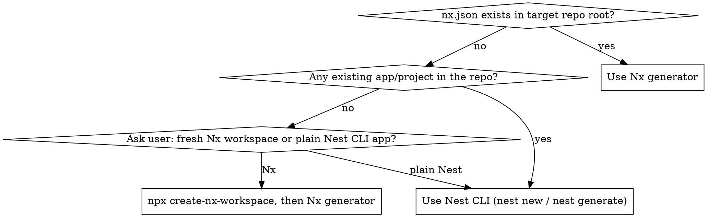

# Scaffolding a new NestJS app

## Overview

Turns a blank directory (or a new app inside an existing Nx monorepo) into a NestJS service with the author's
standard baseline: pino logging, unified `ApiResponse` contract + global exception filter, ESLint/Prettier, Vitest
with coverage, husky pre-commit/pre-push, and Docker/Compose/Makefile deployment scaffolding. Templates live in
`templates/` next to this file — copy and adapt them, don't retype from memory.

## When to use

- User asks to create a new NestJS app/service/microservice from scratch.
- User asks to add a new backend app to an existing Nx (or other) monorepo.
- NOT for adding a single feature/module to an already-scaffolded app — this skill is for the initial bootstrap only.

## Step 0 — Detect the environment



- **`nx.json` present** → `npx nx g @nx/nest:application apps/<app-name>` (ask for the app name/path if not given;
  add `@nx/nest` to devDependencies first if the plugin isn't installed yet).
- **No `nx.json`, but the repo already has at least one app/package** → this is a non-Nx multi-app repo; use
  `nest new <app-name>` or `nest generate` following whatever structure the existing apps use. Do not silently
  introduce Nx into a repo that doesn't use it.
- **No `nx.json` and no existing app at all (empty/fresh repo)** → this is the "first app in the project" case.
  **Always ask the user** whether to set up an Nx workspace (`npx create-nx-workspace@latest`, then the Nx generator
  above) or a plain standalone Nest CLI app (`npx @nestjs/cli new .`). Do not assume either — this decision shapes
  every later step (which template variants to use: `*.standalone.*` vs the Nx/monorepo ones).

## Step 1 — Install dependencies

Full list this skill needs — install latest versions (`@latest`), don't pin manually. In a monorepo, check the
workspace root `package.json` first and only add what's actually missing; most of the eslint/vitest tooling is
usually already there.

**Dependencies:**
```
npm install nestjs-pino pino pino-http class-validator class-transformer
```
Add `axios` too if the exception filter's axios-error branch will be used (see Step 5) — skip it otherwise.

**Dev dependencies:**
```
npm install -D pino-pretty eslint prettier eslint-config-prettier eslint-plugin-import eslint-plugin-prettier typescript-eslint vitest @vitest/coverage-v8 unplugin-swc vite-tsconfig-paths husky lint-staged
```
Monorepo only — also add `@nx/eslint-plugin` if it isn't already a workspace dependency.

## Step 2 — Post-generation cleanup: strict TypeScript, remove Jest and e2e scaffolding

**Strict mode is the default for every app in this stack — verify it, don't assume the generator set it.** Open the
app's `tsconfig.json` (standalone) or the workspace `tsconfig.base.json` (monorepo) and confirm
`"compilerOptions"."strict": true` is set. `nest new`'s default template already sets it, but `@nx/nest:application`
inherits from the workspace `tsconfig.base.json`, which may predate this convention — set it explicitly if missing.
Do not turn off individual strict sub-flags (`strictNullChecks`, `noImplicitAny`, etc.) to work around type errors
during scaffolding — fix the underlying type instead.

Both `nest new` and `@nx/nest:application` scaffold Jest by default — this author's stack uses **Vitest only**, and
no separate e2e test target. Immediately after generating the app, before touching anything else, delete:

- `jest.config.ts`/`jest.config.js` (app-level and, for a fresh standalone repo, the root one)
- `test/` (the generated e2e folder, typically containing `app.e2e-spec.ts` and `jest-e2e.json`)
- Any `*.spec.ts` files Jest-generated alongside sources (e.g. `src/app.controller.spec.ts`) — delete rather than
  port to Vitest; write real spec files later, per the project's own testing conventions, when there's actual logic
  to cover.
- `jest`-related devDependencies: `jest`, `@nestjs/testing` (only if not otherwise needed — this project doesn't use
  it), `ts-jest`, `@types/jest`, `jest-environment-node` (check `package.json` for exactly which ones the generator
  added; the Nx/Nest generator version determines the precise list — remove whatever it inserted).
- `jest` config blocks embedded in `package.json` (Nx's `@nx/nest:application` and plain `nest new` both add a
  top-level `"jest"` key) and any `test`/`test:e2e`/`test:watch`/`test:cov` npm scripts pointing at Jest — these get
  replaced by Vitest equivalents in Step 7.
- For an Nx monorepo app: also delete the generated `project.json` `test`/`e2e` targets that reference
  `@nx/jest:jest` — Step 8 replaces them with `nx:run-commands` + `vitest run`, matching the rest of the workspace's
  apps.

**Vitest/`tsc` wiring, so spec files don't break the production build or the IDE:**

1. Add `"exclude": ["src/**/*.spec.ts", "src/**/*.test.ts"]` to `tsconfig.app.json` (next to `"include"`) — otherwise the production build picks up spec files and fails on Vitest-only globals like `vi`.
2. Create `tsconfig.spec.json`: `{ "extends": "./tsconfig.json", "compilerOptions": { "types": ["vitest/globals"] }, "include": ["src/**/*.spec.ts", "src/**/*.test.ts", "vitest.config.ts"] }` — without it the IDE and `tsc` report `Cannot find name 'vi'` in spec files even though Vitest itself runs them fine.
3. In every spec file, import `vi` explicitly from `'vitest'` rather than relying on the global alone — the IDE resolves types from `tsconfig.spec.json` only when it's actually using that config, and an explicit import works regardless.

## App Baseline: Config, Global Prefix, Validation

Before Step 3, make sure `main.ts`/`app.module.ts` have this baseline, regardless of what the generator produced: a global `ConfigModule` validating `PORT` (Joi or class-validator, `getOrThrow` at usage sites — never a bare `process.env.PORT`), `app.setGlobalPrefix('api')`, a global `ValidationPipe` with `transform: true` + `whitelist: true` + implicit conversion enabled, and `useContainer(app, { fallbackOnErrors: true })` so `class-validator`'s custom decorators can use Nest DI. If the app sits behind a Traefik (or equivalent) reverse proxy that strips a service-name prefix before forwarding, the app's own routes stay at plain `/api/...` — the proxy's route pattern (e.g. `/{service_name}/api` with a strip-prefix middleware) is the proxy's concern, not something the app needs to know about internally.

## Step 3 — Ask about API versioning

**Always ask the user** whether the new app needs URI API versioning before writing `main.ts` — don't default to
either answer. Some apps in this stack enable it (`ext-gate`), others don't (`bot-gateway`, `miniapp-gate`,
`bot-publisher`); it's a per-app decision, not a blanket convention.

If yes, add to `main.ts` (after `setGlobalPrefix`, before `useContainer`):
```ts
import { VersioningType } from '@nestjs/common';

app.enableVersioning({
  type: VersioningType.URI,
  defaultVersion: '1',
});
```
This makes routes resolve as `/api/v1/...`. If no, skip it — routes stay at `/api/...`.

## Step 4 — Wire the pino logger

Copy the whole `templates/pino/` directory into the new app — it's five files that compose together, not one
monolithic module:

| Template file | Role |
|---|---|
| `pino-config.types.ts` | `AppLoggerOptions`, `AppLoggerContextFilter`, `PinoConfig` + their `is*` type guards |
| `pino-config.constants.ts` | `REDACT_AUTH_HEADER_PATHS` (auth/token headers redacted by default), `PINO_CONFIG_FILENAME` |
| `pino-config.helpers.ts` | `buildPinoParams` — pure builder: pretty-transport, redact paths, context-blacklist hook |
| `pino-config.loader.ts` | `loadPinoConfig` — reads optional `pino.config.json` from cwd when `PINO_CONFIG_ENABLED=true` |
| `app-logger.module.ts` | `AppLoggerModule.forRoot`/`forRootAsync` — thin `nestjs-pino` wrapper composing the four above |

Placement:
- Monorepo with multiple Nest apps already sharing code → put the whole directory in a shared lib (e.g.
  `libs/nest-logger`) if one doesn't already exist; if it does, just depend on it — **do not duplicate**.
- Standalone app or first app in a monorepo → `src/common/logger/` inside the app itself, same five files.

**What each option controls** (`AppLoggerOptions`, consumed by `buildPinoParams`):
- `level` — pino log level (`'info'`, `'debug'`, …).
- `pretty` — dev-mode `pino-pretty` transport (`colorize: true`, `translateTime: 'SYS:standard'`). Off in prod —
  NDJSON goes to whatever log shipper is downstream, colorized/formatted output would just be noise there.
- `singleLine` — passed straight through to `pino-pretty`'s own `singleLine` option; `true` keeps one log line per
  request even with a large `req`/`res` payload, `false` pretty-prints multi-line for easier local reading of deeply
  nested objects.
- `pinoConfigEnabled` — when `true`, `loadPinoConfig` requires a `pino.config.json` in `process.cwd()` shaped
  `{ contextFilter?: { blacklist: string[] }, redactPaths?: string[] }` and throws a descriptive error if it's
  missing or malformed; when `false` (the default), no file is read and only the built-in redact paths apply. Use
  this escape hatch for noisy per-project cases (a health-check module's own `context` flooding dev logs, a field the
  built-in redact list doesn't cover) instead of hand-editing the shared lib per project.

**`LOG_LEVEL`/`LOG_PRETTY`/`LOG_PRETTY_SINGLE_LINE`/`PINO_CONFIG_ENABLED` — pick one Joi shape for all four and stay
consistent.** Two shapes both work; the failure mode is mixing them:
- **String shape** (`Joi.string().empty('').valid('true', 'false').default('true')`, compared as `config.get<string>('LOG_PRETTY') === 'true'`)
  — the shape this skill defaults to; needed if the same env value is ever read outside `ConfigService` (e.g. echoed
  into a shell script) where a native boolean can't survive serialization.
- **Boolean shape** (`Joi.boolean().default(false)`, read as `config.getOrThrow<boolean>('LOG_PRETTY')`) — simpler
  when nothing outside Nest's own `ConfigService` needs the raw value.

**Whichever shape you pick, apply it identically to all four keys.** Mixing them is the actual bug this warning
exists for: declaring `LOG_PRETTY: Joi.boolean()` while comparing `config.get<string>('LOG_PRETTY') === 'true'`
silently evaluates to `false` — no validation error, just wrong logs, because a real `boolean` is never `===` to the
string `'true'`. Match the schema's declared type to how the factory reads it, key by key.

String-shape example:
```ts
LOG_LEVEL: Joi.string().default('info'),
LOG_PRETTY: Joi.string().empty('').valid('true', 'false').default('true'),
LOG_PRETTY_SINGLE_LINE: Joi.string().empty('').valid('true', 'false').default('true'),
PINO_CONFIG_ENABLED: Joi.string().empty('').valid('true', 'false').default('false'),
```

Wire into `app.module.ts` (string-shape factory — swap `=== 'true'`/`config.get<string>` for `config.getOrThrow<boolean>` throughout if using the boolean shape instead):
```ts
AppLoggerModule.forRootAsync({
  imports: [ConfigModule],
  inject: [ConfigService],
  useFactory: (config: ConfigService): AppLoggerOptions => ({
    level: config.getOrThrow<string>('LOG_LEVEL'),
    pretty: config.get<string>('LOG_PRETTY') === 'true',
    singleLine: config.get<string>('LOG_PRETTY_SINGLE_LINE') === 'true',
    pinoConfigEnabled: config.get<string>('PINO_CONFIG_ENABLED') === 'true',
  }),
}),
```
And in `main.ts`: `NestFactory.create(AppModule, { bufferLogs: true })` then `app.useLogger(app.get(Logger))`
(`Logger` from `nestjs-pino`).

**Env vars — update all three places** per this repo's own env-var convention (Joi schema above, root `.env.example`,
and — in a monorepo with a `devops/` deployment layer — `devops/.env.example` + the corresponding
`docker-compose.prod.yml` service env block): `LOG_LEVEL`, `LOG_PRETTY`, `LOG_PRETTY_SINGLE_LINE`,
`PINO_CONFIG_ENABLED`. Default `LOG_PRETTY_SINGLE_LINE=true` and `PINO_CONFIG_ENABLED=false` everywhere unless the
project has a specific reason to change either.

After wiring, **actually start the app** (`LOG_PRETTY=true` in `.env`) and confirm colorized single-line output
appears — not raw NDJSON — before moving on. A silently-false `pretty` flag is easy to miss otherwise.

## Step 5 — Wire exception filter + API response interceptor

**First, check for duplication** (this is the step most likely to be skipped): grep the target repo for an existing
`ExceptionFilter`/response-interceptor implementation before creating a new one.
- **Found one, repo is a monorepo** → extract it into a shared lib (mirror this skill's own history: see
  `@chatbot-platform/helpers/nest` as a worked example of exactly this extraction) and have both the existing and
  new app depend on the shared version. Do not leave two divergent copies.
- **Found one, repo is standalone** → reuse it as-is; do not create a second one.
- **None found** → copy `templates/response/api.types.ts`, `api-exception-filter.ts`, `api-response.interceptor.ts`.
  Fix the `../types/api.types` import path to match where you place the files. If the app has no reason to call
  other HTTP APIs via axios, drop the `isAxiosError` branch and the `axios` import from the filter.

Register in `app.module.ts` providers — **not** `main.ts` `useGlobalFilters`/`useGlobalInterceptors` — and put
`ApiResponseInterceptor` **last** among any other `APP_INTERCEPTOR` entries so it wraps their output:
```ts
providers: [
  { provide: APP_INTERCEPTOR, useClass: ApiResponseInterceptor },
  { provide: APP_FILTER, useClass: ApiExceptionFilter },
],
```

## Step 6 — Wire health endpoint

Every new app in this stack gets a simple, dependency-free liveness endpoint — no `@nestjs/terminus`, no DB/Redis
readiness checks unless the user explicitly asks for those. Pattern (inline, no template file to copy — small enough
to write directly):

`src/app/app.controller.ts`:
```ts
import { Controller, Get } from '@nestjs/common';
import { Public } from '<path-to-shared-public-decorator-or-local-equivalent>';

import { AppService } from './app.service';

@Controller()
export class AppController {
  constructor(private readonly appService: AppService) {}

  @Public()
  @Get('health')
  getHealth(): { service: string; status: string } {
    return this.appService.getHealth();
  }
}
```

`src/app/app.service.ts` (or `src/app/app.service/app.service.ts` if the app already uses the dot-notation subfolder
convention for testable services):
```ts
import { Injectable } from '@nestjs/common';

@Injectable()
export class AppService {
  getHealth(): { service: string; status: string } {
    return {
      service: '<app-name>',
      status: 'ok',
    };
  }
}
```

Register both in `app.module.ts`: `controllers: [AppController]`, add `AppService` to `providers`. The `Public`
decorator marks the route so any global auth guard (`APP_GUARD`) skips it — if the app's guard doesn't yet support a
public-route bypass via `Reflector`/metadata, add that bypass to the guard first (see the guard's own `canActivate`
for where to add a `Reflector.getAllAndOverride` check before the auth logic). Resulting path: `/api/health`, or
`/api/v1/health` if Step 3 (versioning) was enabled for this app.

## Step 7 — ESLint + Prettier

Copy `templates/eslint/eslint.base.config.mjs` to the repo root (or merge with the existing one if present — don't
overwrite a customized base). Strip the `@nx/enforce-module-boundaries` block and the `apps/*/libs/*` tsconfig glob
paths for a standalone (non-Nx) app — see the inline comments in the template for exactly what to remove.

For a monorepo app, also copy `templates/eslint/eslint.app.config.mjs`, replacing `__APP_NAME__` with the real app
name, as `apps/<app-name>/eslint.config.mjs`.

Copy `templates/eslint/.prettierrc` and `templates/eslint/.prettierignore` to the repo root (skip if both already
exist there — don't overwrite a customized config). `eslint.base.config.mjs` enforces `prettier/prettier: 'error'`,
so formatting mismatches between `.prettierrc` and the ESLint rule will fail lint otherwise.

## Step 8 — Vitest

Copy `templates/vitest/vitest.config.ts` and `templates/vitest/vitest.setup.ts` into the new app (`vitest.config.ts`
at the app root, `src/test/vitest.setup.ts`). Keep the `coverage.exclude` list — it encodes this author's convention
that `*.api.service.ts`, `*.repository.ts`, DTOs, modules, controllers, and the exception filter are not unit-tested
(logic-free glue or already covered indirectly). Leave `thresholds` commented out for a brand-new app with no tests
yet — uncomment once the project has meaningful coverage, don't block the first commits on an 80% threshold.

## Step 9 — Pre-commit / pre-push hooks

Run `npx husky init` if `.husky/` doesn't exist yet. Copy:
- `templates/husky/pre-commit` → `.husky/pre-commit` (same in both paths).
- Monorepo: `templates/husky/pre-push.nx` → `.husky/pre-push`, `templates/husky/lintstagedrc.nx.js` →
  `.lintstagedrc.js` (root, shared across apps — don't duplicate per-app).
- Standalone: `templates/husky/pre-push.standalone` → `.husky/pre-push`,
  `templates/husky/lintstagedrc.standalone.js` → `.lintstagedrc.js`.

Make both hook files executable (`chmod +x .husky/pre-commit .husky/pre-push`).

## Step 10 — Docker / docker-compose / Makefile / .env.example

- **Standalone app**: copy `templates/docker/Dockerfile.standalone` → `devops/Dockerfile`,
  `templates/docker/docker-compose.standalone.yml` → `devops/docker-compose.yml`,
  `templates/docker/Makefile.standalone` → `Makefile`, `templates/docker/.env.example.standalone` → `.env.example`.
- **Monorepo, shared parametrized Dockerfile already exists** (`ARG APP_NAME`) → read
  `templates/docker/dockerfile-monorepo-reference.md`, confirm the existing `devops/Dockerfile` matches that shape,
  and do **not** create a new one — just add a service block using
  `templates/docker/docker-compose-service-snippet.monorepo.md` as the pattern (replace `__APP_NAME__` /
  `__APP_NAME_UPPER__` placeholders), and add the new env vars per
  `templates/docker/env-example-snippet.monorepo.md`. Reuse the existing root `Makefile` unchanged.
- **Monorepo, first app, no devops/ setup yet** → create `devops/Dockerfile` from
  `templates/docker/dockerfile-monorepo-reference.md`'s reference block, and the root `Makefile` from
  `templates/docker/Makefile.monorepo-reference` (replace `__PROJECT_NAME__` with the repo name). That Makefile's
  `prod-*`/`dev0-*` targets reference `docker-compose.networks.brandnew.yml`/`.existing.yml` and a
  `docker-compose.base.yml` — these encode a specific brand-new-vs-existing-Docker-network deployment topology from
  the source project; only bring them in if the new repo needs that same split. Otherwise drop the `_BNN`/`_EXN`
  variables and point `COMPOSE_PROD` targets straight at `docker-compose.prod.yml`.

## Step 11 — Monorepo: add a root `package.json` start script

Monorepo only (skip for standalone apps — `npm run start` is already the app's own entrypoint there). Add a
`start:<app-name>` script to the workspace root `package.json`, matching the existing convention (e.g.
`"start:ext-gate": "nx run ext-gate:serve"`). Without it the new app has no documented local-run entrypoint
alongside the other apps' `start:*` scripts.

## Step 12 — Document the conventions in the target repo

Append `templates/docs/claude-md-nestjs-snippet.md` (with `__APP_NAME__` replaced and paths adjusted) into the
target repo's `CLAUDE.md` and/or `AGENTS.md`, next to whatever other conventions already exist there. If the repo
has neither file yet, create `CLAUDE.md` at the repo root with this content as a starting point.

Also append `templates/docs/claude-md-skills-workflow-snippet.md` — this is stack-agnostic (how to work with
skills/subagents, plan mode, commit discipline, workflow-artifact locations) and belongs in every project's
`CLAUDE.md`, not just NestJS ones. Skip it only if the target repo's `CLAUDE.md` already documents equivalent
skills-workflow conventions — don't duplicate.

## Step 13 — .gitignore AI artifacts

Append `templates/docs/gitignore-ai-artifacts-snippet.txt` to the target repo's `.gitignore` (create the file if it
doesn't exist). `CLAUDE.md`/`AGENTS.md`/`MEMORY.md` are written by Step 11 above but must stay untracked — they are
AI working artifacts, not project source. Check for existing entries first; don't duplicate lines already present.

## Quick reference — template files

| File | Purpose | Standalone-only edits |
|---|---|---|
| `templates/pino/app-logger.module.ts` | `nestjs-pino` wrapper module (composes the four files below) | none |
| `templates/pino/pino-config.types.ts` | `AppLoggerOptions`/`PinoConfig` types + type guards | none |
| `templates/pino/pino-config.constants.ts` | Default redact paths, `pino.config.json` filename | none |
| `templates/pino/pino-config.helpers.ts` | `buildPinoParams` pure builder | none |
| `templates/pino/pino-config.loader.ts` | Optional `pino.config.json` loader | none |
| `templates/response/api.types.ts` | `ApiResponse<T>` contract | none |
| `templates/response/api-exception-filter.ts` | Global `@Catch()` filter | drop axios branch if unused |
| `templates/response/api-response.interceptor.ts` | Wraps controller returns | none |
| `templates/eslint/eslint.base.config.mjs` | Root flat ESLint config | strip Nx boundary rule + glob tsconfig paths |
| `templates/eslint/eslint.app.config.mjs` | Per-app ESLint override | monorepo only |
| `templates/eslint/.prettierrc` + `.prettierignore` | Prettier formatting rules | none |
| `templates/vitest/vitest.config.ts` + `vitest.setup.ts` | Test runner + coverage | none |
| `templates/husky/pre-commit` | lint-staged hook | none |
| `templates/husky/pre-push.nx` / `pre-push.standalone` | test-on-push hook | pick one |
| `templates/husky/lintstagedrc.nx.js` / `lintstagedrc.standalone.js` | lint-staged config | pick one |
| `templates/docker/Dockerfile.standalone` / `dockerfile-monorepo-reference.md` | Multi-stage build | pick one |
| `templates/docker/docker-compose.standalone.yml` / `docker-compose-service-snippet.monorepo.md` | Deploy config | pick one |
| `templates/docker/Makefile.standalone` / `Makefile.monorepo-reference` | `local-up`/`down`/`clean` targets | pick one |
| `templates/docker/.env.example.standalone` / `env-example-snippet.monorepo.md` | Env var baseline | pick one |
| `templates/docs/claude-md-nestjs-snippet.md` | NestJS-specific conventions writeup for the target repo | adjust paths |
| `templates/docs/claude-md-skills-workflow-snippet.md` | Stack-agnostic skills/subagents workflow rules | none |
| `templates/docs/gitignore-ai-artifacts-snippet.txt` | Keeps CLAUDE.md/AGENTS.md/MEMORY.md untracked | none |

## Common mistakes

| Mistake | Fix |
|---|---|
| Registering the filter/interceptor via `app.useGlobalFilters()` in `main.ts` | Register via `APP_FILTER`/`APP_INTERCEPTOR` providers in `app.module.ts` instead |
| Putting `ApiResponseInterceptor` before other `APP_INTERCEPTOR`s | It must be last so it wraps their output |
| Creating a second exception filter/interceptor when one already exists in the monorepo | Extract the existing one into a shared lib and reuse |
| Copying the Nx `@nx/enforce-module-boundaries` ESLint rule into a standalone app | Strip it — there are no libs/apps boundaries to enforce |
| Setting hard coverage thresholds on day one | Leave `thresholds` commented out until the app has real tests |
| Creating a brand-new per-app Dockerfile in a monorepo that already has a shared parametrized one | Reuse the shared `devops/Dockerfile` with `ARG APP_NAME`, just add a compose service block |
| Adding a new env var to only one of the three required places | Joi schema + root `.env.example` + `devops/.env.example` (+ compose `environment:` block) — all three, every time |
| Skipping the health endpoint because the app "is internal" | Every HTTP app gets `GET /health` (or `/api/health` with global prefix) — internal-only apps still need it for orchestration liveness checks |
